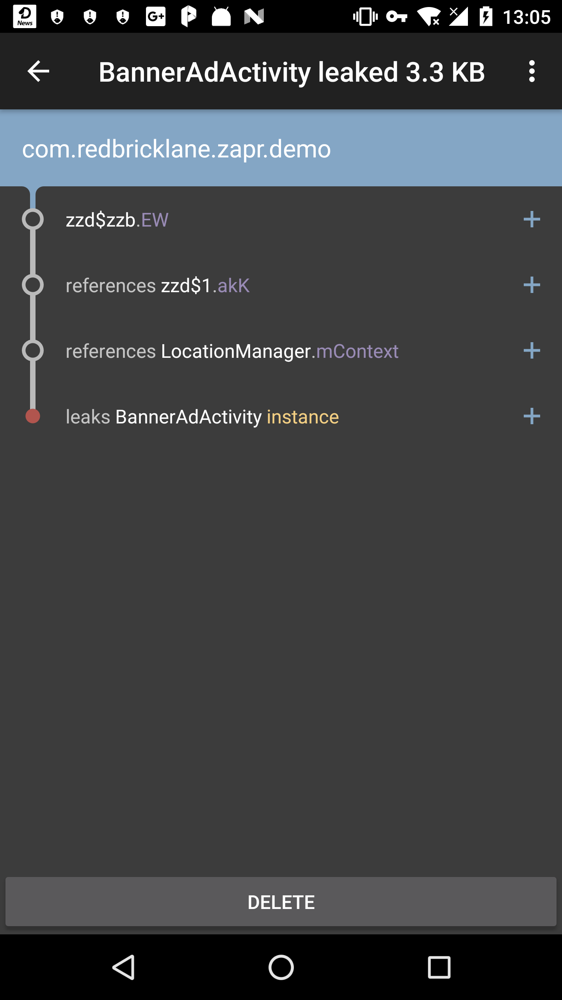

# Zapr SDK Sample App

## Memory Leak In BannerAdActivity

> BannerAdActivity will cause memory leak 100%. Please use LeakCanary and MAT to find out the reasons, and fix it.

1. open the app
2. click "LOAD BANNER AD"
3. loaded banner ad in BannerAdActivity
4. back to ZaprSDK

repeat step 1 ~ 4 several times, and you will get leakcanary's report from notifications ( It will take some times to analysis the memory leak hprof).

